# Critique: GitHub Repo Integration Recommendation

**Date:** 2026-03-16
**Scope:** Review of `githubintegrationcandidate.md` against the existing PromptForge codebase
**Methodology:** Static analysis of source code, dependency graph, deployment topology, and domain model

---

## 1. Executive Summary

The recommendation document provides a sound high-level architecture direction — search-first UI, budget-aware context, incremental preview complexity. However, after auditing the codebase, there are **seven material gaps, three factual inaccuracies, and four architectural conflicts** that would cause implementation problems if not addressed before work begins.

The most critical findings:

1. **cmdk is unused** — it is a phantom dependency, not "already in the repo" in any functional sense.
2. **The existing GitHub OAuth is for Neon Auth sign-in, not API access** — it cannot be reused for repo access.
3. **The context budget system has hard limits** that fundamentally conflict with repo-scale content.
4. **`repomix` is already a dev dependency** and the recommendation does not acknowledge it.
5. **No backend hosting strategy** — the document says "backend" without specifying where it runs.

---

## 2. Factual Inaccuracies

### 2.1 "cmdk is already in the repo"

The recommendation states cmdk is already in the repo and recommends building the search UI around it. This is **technically true but functionally false**.

- [`package.json`](package.json:87) lists `"cmdk": "^1.1.1"` as a dependency.
- **Zero source files import cmdk.** A regex search for `cmdk`, `CommandDialog`, `CommandInput`, `CommandList`, `CommandItem`, `CommandGroup` across all `*.tsx` and `*.ts` files returns no results.
- The UUI [`combobox.tsx`](src/components/base/select/combobox.tsx:1) uses React Aria (`AriaComboBox`), not cmdk. The `⌘K` shortcut hint visible in the combobox is a visual label, not a cmdk integration.
- cmdk is a phantom dependency — installed but never wired up.

**Risk:** Planning around "cmdk is already here so it is lower-risk" is incorrect. Introducing cmdk means building a new component from scratch. The actual lower-risk path would be extending the existing UUI ComboBox or building on React Aria directly, which is the established pattern in this codebase.

### 2.2 Implied reuse of existing GitHub OAuth

The recommendation does not explicitly claim reuse, but the architecture section jumps straight to "GitHub App + Octokit" without acknowledging that the existing GitHub OAuth flow is **identity-only** and serves a completely different purpose.

Current state:
- [`AuthDialog.tsx`](src/components/AuthDialog.tsx:211) offers GitHub as an OAuth sign-in provider.
- [`auth-provider.tsx`](src/hooks/auth-provider.tsx:129) delegates to `neon.auth.signInWithOAuth({ provider: "github" })` — this is **Neon Auth** (Better Auth adapter), not a GitHub API OAuth flow.
- The resulting session is a Neon JWT. No GitHub access token is stored or accessible to the application.
- The OAuth scopes are controlled by Neon Auth configuration, not the app.

**Risk:** Implementers may assume they can extract a GitHub access token from the existing auth session. They cannot. A GitHub App installation flow is an entirely separate OAuth pathway requiring its own callback endpoint, token exchange, and storage.

### 2.3 "The production workflow does not include a bundled API surface in the SWA app itself"

This is accurate, but the document then says "a GitHub integration for private or org repos requires a real backend integration path" without specifying what that backend is. The existing backend — the agent service at [`agent_service/codex_service.mjs`](agent_service/codex_service.mjs:1) — is deployed as a separate Azure Web App (`ai-prompt-pro-agent`). The document does not state whether the GitHub backend endpoints should:

- Live inside the existing agent service
- Be a new separate service
- Use Azure Functions attached to the SWA

This is not a factual error but an omission that reads as if the backend path is obvious when it is not.

---

## 3. Architectural Conflicts

### 3.1 Context source type system has no `github` or `repo` kind

The existing [`ContextSourceType`](src/lib/context-types.ts:1) is a union:

```typescript
type ContextSourceType = "text" | "url" | "file" | "database" | "rag";
```

[`ContextReference.kind`](src/lib/context-types.ts:5) mirrors this:

```typescript
kind: "url" | "file" | "database" | "rag";
```

Adding a GitHub repo source requires extending both unions. Per [`CLAUDE.md`](CLAUDE.md:46), adding a new context field requires synchronized updates to:

- [`defaultContextConfig`](src/lib/context-types.ts:82) and [`buildContextBlock()`](src/lib/context-types.ts:255)
- [`scorePrompt()`](src/lib/prompt-builder.ts:476) 
- `getSectionHealth()` in `src/lib/section-health.ts`
- [`normalizeTemplateConfig()`](src/lib/template-store.ts:35) for persistence compatibility

The recommendation does not address this type-system extension or the downstream persistence impacts.

### 3.2 Context budget limits are fundamentally undersized for repo content

Current hard limits in [`enhance-context-sources.ts`](src/lib/enhance-context-sources.ts:22):

| Constant | Value | Repo-scale problem |
|----------|-------|--------------------|
| `MAX_ENHANCE_CONTEXT_SOURCE_COUNT` | 8 | A typical file selection from a repo is 10–50 files |
| `MAX_ENHANCE_CONTEXT_SOURCE_RAW_CHARS` | 12,000 per source | A single 300-line source file is ~12K chars |
| `MAX_ENHANCE_CONTEXT_SOURCE_TOTAL_RAW_CHARS` | 32,000 total | 3–5 typical source files exhaust this |

Additionally, [`MAX_PROMPT_CHARS`](agent_service/README.md:170) on the agent service is 32,000 characters. The prompt itself plus context sources plus system instructions must all fit within this.

The recommendation says "the model input maximum should be treated as a hard ceiling" but does not address that the **existing ceilings are designed for small, hand-curated attachments** — not repo-scale file sets. Implementing the recommendation without raising or redesigning these limits would result in a feature that can attach 2–3 files from a repo before hitting a wall.

**What is needed:** A new budget allocation strategy — likely a separate "repo context budget" that is larger than the current source budget, with intelligent summarization/chunking as the recommendation suggests, but with specific numeric proposals that fit the actual model context windows being used.

### 3.3 File type and size constraints in the current source UI

[`ContextSourceChips.tsx`](src/components/ContextSourceChips.tsx:38) enforces:

```typescript
const ALLOWED_EXTENSIONS = [".txt", ".md", ".csv", ".json", ".xml", ".log", ".yaml", ".yml"];
const MAX_FILE_SIZE = 500 * 1024; // 500KB
```

A repo integration would need to handle `.ts`, `.tsx`, `.js`, `.jsx`, `.py`, `.go`, `.rs`, `.java`, `.rb`, `.css`, `.html`, `.sql`, `.toml`, `.lock`, and dozens more. The current extension allowlist and 500KB cap are not relevant to repo files fetched via API, but a developer might incorrectly try to funnel GitHub files through the existing `ContextSourceChips` add flow.

The recommendation says "normalize selected content into the existing source/context flow where possible" — this needs to be qualified: the **data model** can be reused, but the **UI ingestion path** must be new.

### 3.4 Agent service is not structured for multi-domain endpoints

The agent service ([`codex_service.mjs`](agent_service/codex_service.mjs:1), 2,370 lines) is a monolithic HTTP server handling three domains: enhancement, URL extraction, and builder field inference. Its routing is inline (`if (pathname === "/enhance")` style), not framework-based.

Adding GitHub endpoints (OAuth callback, manifest build, file content fetch, installation management) would require:

- New route handlers in an already large file, or a routing refactor
- GitHub App webhook handling (installation events, permission changes)
- Short-lived token management (GitHub installation tokens expire in 1 hour)
- State that doesn't currently exist (installation IDs, cached manifests)

The current service is stateless with only in-memory rate-limit counters. GitHub App integration requires persistent state for installation records.

---

## 4. Gaps in the Recommendation

### 4.1 `repomix` is already available and unacknowledged

[`package.json`](package.json:134) includes `"repomix": "^1.12.0"` as a dev dependency, and [`repomix.config.json`](repomix.config.json) exists in the repo root. Repomix is specifically designed to package repository contents as LLM context — exactly the use case described in the recommendation.

The recommendation builds an entire "normalized file manifest" concept from scratch without considering whether repomix (or its output format) could serve as the manifest layer or at least inform the schema design. At minimum, the recommendation should acknowledge repomix and explain why it is or is not sufficient.

### 4.2 No database schema for repo connections

The recommendation describes connecting repos, caching manifests, and managing GitHub App installations. None of these concepts exist in the current Neon Postgres schema ([`supabase/migrations/`](supabase/migrations/)). The recommendation should address:

- Where installation records are stored (user ↔ GitHub App installation mapping)
- Where cached manifests live (Neon? In-memory? Redis?)
- Whether repo connections are per-user, per-prompt, or per-workspace
- RLS policies for repo connection records (the app has thorough RLS patterns)

### 4.3 No consideration of the enhancement pipeline interaction

The recommendation focuses on getting repo content **into** the context system but does not address how the enhancement pipeline ([`enhancement-pipeline.mjs`](agent_service/enhancement-pipeline.mjs)) would **use** repo context differently from other sources.

Current enhancement flow:
1. [`buildEnhanceContextSources()`](src/lib/enhance-context-sources.ts:34) truncates and normalizes sources
2. Sources are sent to the agent service as `context_sources`
3. The service runs a source-expansion decision step to determine which sources need deeper content
4. Expanded content is injected into the enhancement prompt

For repo sources, the enhancement pipeline may need:
- Awareness that sources are code files (different summarization strategy)
- Ability to request related files not in the initial selection (e.g., imports, type definitions)
- Different truncation heuristics for code vs. prose

### 4.4 No discussion of rate limits and GitHub API quotas

GitHub API rate limits are aggressive:
- Unauthenticated: 60 requests/hour
- User token: 5,000 requests/hour
- GitHub App installation token: 5,000 requests/hour (shared across all users of that installation)

Building a manifest for a large repo can consume hundreds of API calls (the Trees API returns up to 100K entries per call, but file content requires individual requests). The recommendation should address:

- Whether manifest building uses the Git Trees API (single call) or Contents API (per-file)
- Caching strategy for manifests (TTL, invalidation on push)
- Rate limit pooling across users of the same installation

### 4.5 No mention of the ContextConfig integration point

The recommendation talks about "normalizing selected content into the existing source/context flow" but doesn't identify the actual integration point: [`ContextConfig`](src/lib/context-types.ts:72). This interface holds `sources: ContextSource[]` along with database connections, RAG parameters, structured context, and project notes. A GitHub repo connection could be:

- A new field on `ContextConfig` (e.g., `repoConnections: RepoConnection[]`)
- A new source type within the existing `sources` array
- Both (a connection record plus individual file sources)

This architectural decision has cascading effects on persistence serialization, template snapshots, config adapters, and the builder UI layout.

---

## 5. Risks

### 5.1 Scope creep from "search-first" to "needs-a-tree"

The recommendation wisely defers tree UI, but the search-first approach requires the manifest to be loaded client-side for responsive filtering. For repos with 10K+ files, this means:

- ~1–5 MB manifest payload transfer
- Client-side fuzzy search over 10K+ items
- No incremental loading without server-side search

If server-side search is needed, the "simple cmdk search" becomes a backend search API with debouncing, pagination, and caching — significantly more complex than the recommendation implies.

### 5.2 GitHub App registration and review

Creating a GitHub App that requests `contents:read` on private repos requires GitHub App review for public distribution. If the app is only for PromptForge's own users, it can stay as a private app, but the recommendation does not clarify this distinction or the approval timeline.

### 5.3 Token storage security

GitHub App installation tokens must be stored server-side. The agent service currently has no persistent storage and no secrets management beyond environment variables. Adding token storage requires either:

- A new database table with encrypted tokens (Neon Postgres)
- An external secrets manager (Azure Key Vault)
- In-memory-only tokens (lost on restart, requiring re-auth)

---

## 6. What the Recommendation Gets Right

Despite the gaps, the core recommendations are sound:

1. **Search-first over tree-first** — correct for the typical "I know what file I want" use case
2. **Budget-aware context assembly** — the most important architectural concern
3. **Incremental preview complexity** — plain → Shiki → Monaco is the right order
4. **GitHub App over PAT for production** — correct for multi-user SaaS
5. **Not client-side-only for private repos** — correctly identifies the backend requirement
6. **Plugging into the existing source model** — better than a parallel subsystem

---

## 7. Recommended Pre-Implementation Decisions

Before creating an implementation plan, these decisions need answers:

| # | Decision | Options |
|---|----------|---------|
| 1 | Where do GitHub API endpoints live? | Extend agent service / New microservice / Azure Functions |
| 2 | Use cmdk or extend existing UUI ComboBox? | cmdk requires new component; ComboBox is established pattern |
| 3 | New `ContextSourceType` value or new `ContextConfig` field? | Affects persistence, templates, and the full config pipeline |
| 4 | Can repomix inform or replace the manifest layer? | Already a dependency; may reduce custom code |
| 5 | What are the new budget limits for repo sources? | Current 8-source / 32K-char caps are insufficient |
| 6 | Where are GitHub installation tokens stored? | Neon Postgres / Azure Key Vault / In-memory |
| 7 | Is the v1 public-repos-only or private-repos? | Determines whether GitHub App flow is needed at all for v1 |

---

## 8. Architecture Comparison: Current vs. Proposed

```mermaid
graph TB
    subgraph Current Context Flow
        U[User] -->|paste/drop/URL| CSC[ContextSourceChips]
        CSC -->|ContextSource| CC[ContextConfig.sources]
        CC -->|buildEnhanceContextSources| ECS[EnhanceContextSource array]
        ECS -->|POST /enhance| AS[Agent Service]
        AS -->|source expansion decision| LLM[LLM]
    end

    subgraph Proposed GitHub Flow - Gaps Highlighted
        U2[User] -->|connect repo| GA[GitHub App OAuth - NO EXISTING PATH]
        GA -->|installation token| BE[Backend - WHERE?]
        BE -->|Git Trees API| GH[GitHub API]
        GH -->|manifest| MF[Manifest Cache - WHERE STORED?]
        MF -->|search/select| SUI[Search UI - cmdk OR ComboBox?]
        SUI -->|selected files| NCS[New ContextSource type - WHICH TYPE?]
        NCS -->|normalize| CC2[ContextConfig.sources]
        CC2 -->|budget check - NEW LIMITS NEEDED| ECS2[EnhanceContextSource array]
        ECS2 -->|POST /enhance| AS2[Agent Service]
    end

    style GA fill:#f96,stroke:#c00
    style BE fill:#f96,stroke:#c00
    style MF fill:#f96,stroke:#c00
    style SUI fill:#ff9,stroke:#990
    style NCS fill:#ff9,stroke:#990
    style ECS2 fill:#ff9,stroke:#990
```



**Legend:** Red = missing/unaddressed in recommendation; Yellow = partially addressed but needs specifics.
