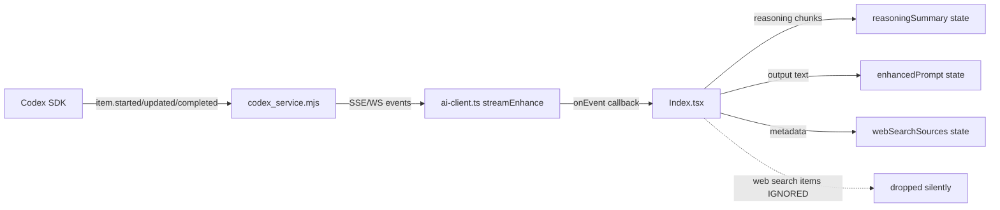
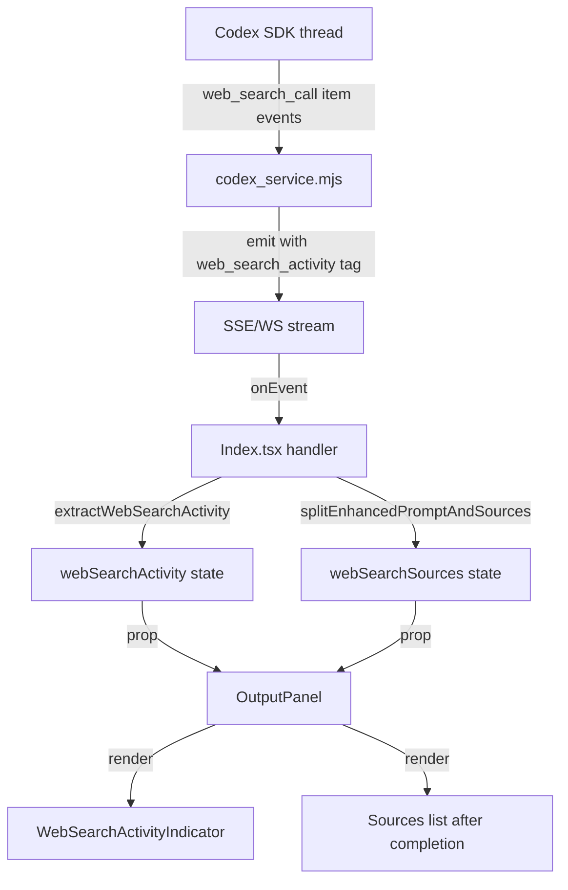

# Plan: Web Search Activity Visibility in Enhancement UI

## Goal

When web search is enabled and the Codex SDK performs web searches during enhancement, show real-time visual feedback in the UI so the user knows the model is actively searching the web — not just thinking.

## Current State

### What exists today

1. **Toggle**: Interactive `Switch` in OutputPanel, BuilderSourcesAdvanced, ContextPanel, and mobile sticky bar.
2. **Thread option**: `webSearchEnabled: boolean` flows from UI → `ai-client.ts` → `codex_service.mjs` → Codex SDK thread options.
3. **System prompt**: `enhancement-pipeline.mjs` includes a `## WEB SEARCH` directive encouraging the model to search when enabled.
4. **Sources display**: After enhancement completes, `splitEnhancedPromptAndSources()` parses markdown source links from the final text. Sources appear in OutputPanel and a "Recent web sources" card.
5. **No real-time activity**: During streaming, there is zero visual indication that web search is happening.

### How events flow



### Codex SDK web search event shapes

When `webSearchEnabled: true`, the SDK emits tool-use items with types such as:
- `web_search_call` / `web_search` — the model initiates a search query
- `function_call` with name containing "search" — alternative shape
- These arrive as `item.started` → `item.updated` → `item.completed` with the item's `type` field

The backend currently forwards all non-streamed-text items as generic `item.started/updated/completed` events. The frontend receives them in `onEvent` but does not recognize or act on web-search item types.

## Proposed Architecture

### Layer 1: Backend — Identify and tag web search events

Add a `isWebSearchItemType()` helper in `codex_service.mjs` alongside the existing `isAgentMessageItemType()` and `isReasoningItemType()`. When a web search item is detected, emit an enriched event shape:

```js
// New helper
function isWebSearchItemType(itemType) {
  const normalized = normalizeItemType(itemType);
  if (!normalized) return false;
  return (
    normalized === "web_search_call"
    || normalized === "web_search"
    || normalized === "web_search_result"
    || /(^|[./_-])web[_-]?search([./_-]|$)/.test(normalized)
    || /(^|[./_-])search[_-]?call([./_-]|$)/.test(normalized)
  );
}
```

For `item.started`, `item.updated`, `item.completed` events where `isWebSearchItemType(itemType)` is true, emit with an additional `web_search_activity` envelope:

```json
{
  "event": "item.started",
  "type": "response.output_item.added",
  "item_type": "web_search_call",
  "item_id": "item_ws_1",
  "web_search_activity": {
    "phase": "searching",
    "query": "extracted query if available"
  }
}
```

### Layer 2: Frontend — Detect web search events

Add a new utility `src/lib/enhance-web-search-stream.ts`:

```ts
export type WebSearchPhase = "idle" | "searching" | "found" | "done";

export interface WebSearchActivity {
  phase: WebSearchPhase;
  query: string | null;
  itemId: string | null;
  searchCount: number;
}

export function extractWebSearchActivity(
  event: EnhanceStreamEvent,
  payload: unknown
): WebSearchActivity | null;
```

This detects web search items by `itemType` patterns and extracts:
- Phase: `searching` on `item.started`, `found` on `item.completed`
- Query: from the item payload's arguments/input field
- Count: incremented per unique web search item

### Layer 3: State in Index.tsx

Add two new state variables:

```ts
const [webSearchActivity, setWebSearchActivity] = useState<WebSearchActivity>({
  phase: "idle", query: null, itemId: null, searchCount: 0,
});
```

In the `onEvent` handler (around line 1120), add detection before the reasoning chunk handler:

```ts
const searchActivity = extractWebSearchActivity(event, event.payload);
if (searchActivity) {
  setWebSearchActivity(searchActivity);
  if (!hasReceivedStreamSignal) {
    hasReceivedStreamSignal = true;
    setEnhancePhase("streaming");
  }
  return;
}
```

Reset to `idle` in `onDone` and `onError`.

### Layer 4: UI Component

Create `src/components/WebSearchActivityIndicator.tsx`:

A subtle, inline status bar — not a heavy card. Visually similar to a breadcrumb or progress chip:

```
 🌐 Searching: "react server components best practices"      ·2
```

Design principles:
- **Compact**: Single line, small text, no border or card wrapper — just a lightly styled `div` row
- **Unobtrusive**: Uses `text-xs text-muted-foreground` for text, a small spinning Globe icon for activity
- **Informative**: Shows the current search query in italics, and a dot-prefixed search count badge
- **Ephemeral**: Fades in on first search, updates in-place, fades out 1.5s after the last search completes

States:
- **idle**: Not rendered at all, no layout space consumed
- **searching**: Spinning Globe icon + "Searching..." + truncated query text + count dot
- **found**: Globe stops spinning, brief "✓" flash next to count, then resumes if another search starts
- **done**: `opacity-0 transition-opacity duration-700` fade-out, then unmounts

Uses semantic color tokens: `text-muted-foreground`, `fg-tertiary` for the globe, no background color.

### Layer 5: Integration in OutputPanel

Add the `WebSearchActivityIndicator` to OutputPanel between the reasoning summary card and the main output frame, similar to how reasoning summary is shown:

```tsx
{webSearchActivity.phase !== "idle" && (
  <WebSearchActivityIndicator
    phase={webSearchActivity.phase}
    query={webSearchActivity.query}
    searchCount={webSearchActivity.searchCount}
  />
)}
```

Pass `webSearchActivity` as a new prop to OutputPanel from Index.tsx.

## Data Flow Diagram



## Files to Create/Modify

| File | Action | Purpose |
|------|--------|---------|
| `agent_service/codex_service.mjs` | Modify | Add `isWebSearchItemType()`, enrich web search item events with `web_search_activity` |
| `src/lib/enhance-web-search-stream.ts` | Create | `extractWebSearchActivity()` utility |
| `src/components/WebSearchActivityIndicator.tsx` | Create | Animated activity indicator component |
| `src/pages/Index.tsx` | Modify | Add state, wire `extractWebSearchActivity` in onEvent, pass to OutputPanel |
| `src/components/OutputPanel.tsx` | Modify | Accept and render `webSearchActivity` prop |
| `src/test/enhance-web-search-stream.test.ts` | Create | Unit tests for activity extraction |
| `src/test/web-search-activity-indicator.test.tsx` | Create | Component render tests |
| `src/test/index-web-search-streaming.test.tsx` | Modify | Add integration test for activity display during streaming |
| `docs/prompt-build-and-enhancement.md` | Modify | Document web search activity events |

## Implementation Order

1. Backend: `isWebSearchItemType()` + enriched event emission
2. Frontend utility: `enhance-web-search-stream.ts` + tests
3. UI component: `WebSearchActivityIndicator.tsx` + tests
4. Wiring: Index.tsx state + onEvent handler + OutputPanel prop
5. Integration test in `index-web-search-streaming.test.tsx`
6. Documentation update
